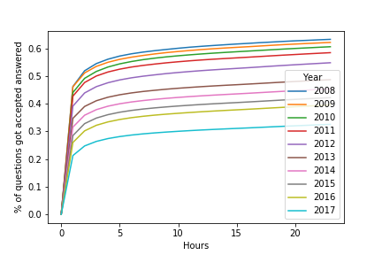
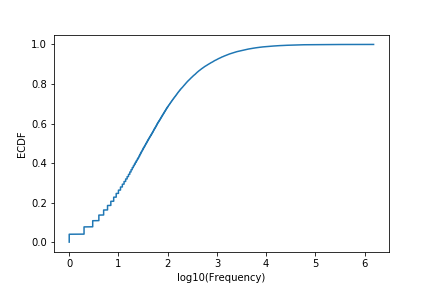
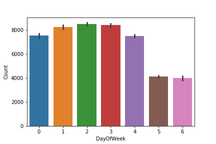
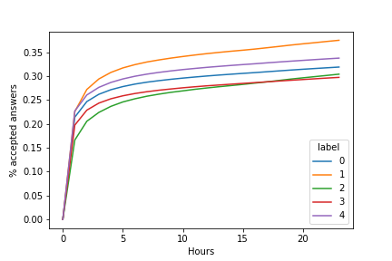
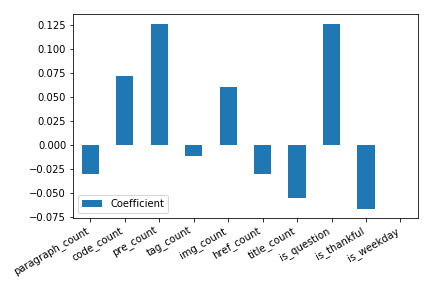
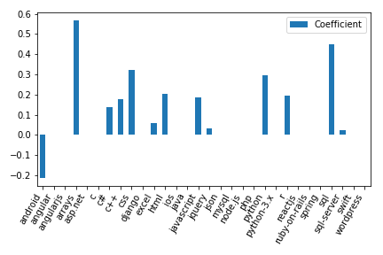

# How do I ask a Good Question?
### A _StackOverflow_ Content Quality Study 

Yuqin Wei  
2019/01/24   

## Background

___StackOverflow___ features questions and answers on a wide range of topics in computer programming. Questions on _StackOverflow_ were often among the first search results from Google, and it has been one of the most popular resources for programmers trying to solve a common problem. Large volume of user-generated data builds up the community and leads to its success.

Since all contents are user-generated, the quality of part of the posts can be questionable. This can be harmful to the whole community in a lot of ways. It creates dummy contents that are both a waste of resource and a distraction to people from more useful information. Some posts may provide wrong and misleading information, damage the integrity and reputation of the community. Some comments are purely individuals judging and hating each other and being irrelevant to the topics. There can also be questions that are potentially valuable, but not properly asked or presented, and as a result not really got a reasonable answer.

In this report, I will try to use some basic data analytics and machine learning tools to dig into the _StackOverflow_ Database, and explore data patterns and potential reasons why some questions can not be answered.

## Data Acquisition and Pre-processing

_StackOverflow_ shares all historical post data through [stackexchange](https://data.stackexchange.com/). Google provides free access to the data but you have to query through Google BigQuery to pull the data with limited quota.
Separately, Brent Ozar converts all XML format data to SQL Server database and posted in his blog post and can be downloaded from [here](https://www.brentozar.com/archive/2015/10/how-to-download-the-stack-overflow-database-via-bittorrent/).

I downloaded a cut of data from 2008 to December 2017, set up a Microsoft SQLServer on a Docker machine and port in the downloaded image. Next, we can easily run some SQL queries on the database to extract tables. Instead of applying complicated SQL logics, I simply converted some partition of the database to csv files after some quick pre-processing steps, so that the feature extraction steps are more reproducible in Jupytor notebooks.

Here are links to some [relevant document](https://github.com/yuqinouou/Springboard/blob/master/CapstoneProject/doc/DatabaseSetup.md) and [notebook](https://github.com/yuqinouou/Springboard/blob/master/CapstoneProject/notebook/StackOverflowdata_processing.ipynb).

## Exploratory Analysis and Feature Extraction

#### Time Trends

The website has been up and running since 2008. We can see an increasing trend of weekly questions posted. By 2014 and onward, there seems to be a slowdown.

If we zoom-in and take a look at hourly post counts with in a week, we can find that there are much more posts on weekdays than at weekend. Furthermore, we tested that Mondays and Fridays question posts numbers are significantly lower than other workdays, statistically.

#### Time to First (Accepted) Answer

After checking all potential quality measures, such as "score" or "favorite counts" of a question, I decided to use "time to the first (accepted) answer" as a proxy if a question posted is good and attractive to answers. This is mainly because the database has timestamps for all answers, and it's much more traceable for every single question. On the contrary, quality measure such as "score" will have the tendency that questions posted for longer will be more likely to have a higher "score". In addition, it is more reliable to measure time to the accepted answer, because there could be noise and wrong information in the literally "first answer", but the "first accepted answer" was at least verified by the question owner.

Here it displays cumulative distribution for both "time" measures within the first hour after a question posted. The blue curve for the "first answer" and the red curve for "first accepted answer". We can see that about 50% of questions get an answer within an hour, and only 30% of the total will get the "verified" answer and later on got accepted.

But what we observed above is largely confounded by when those questions were posted. As we can see on the next two plots, the proportion of "accepted questions" are declining by years.

The percentage of questions got a good answer within an hour dropped from above 40% in 2008 to 20% in 2017, and from 60% to 30% within a day. A couple of reasons may contribute to this problem. Growing user base might actually dilute the quality of the content and average user activity. There are certain topics well covered in question posts in the past, such as 'regular expression'. And then people are running out of good questions on that topic, resulting in more duplication and mediocre content.
While this can separately be an interesting topic, for this study I focused only on posts in 2017, to reduce the influence from secular trend.

### Tags

Users are allowed to put tags on the post, so we can keep track of specific area that each question belong to. For this study, I think it's okay to assume that tags are pretty nicely representation with minimal error, since users should probably be aware of the topic they are asking about, even when the questions themselves may not necessarily be well stated.

There are over 50,000 tags even been used, but we can see that over 90% of tags have only been tagged for less than 1,000 times. Most tags are coding languages, while some others are specific topics.

I extracted the most popular tags by each year, and we can see the change of the popularity.

'C#' was once the most popular, but was replaced by 'java', and then 'javascript' in 2013. 'java' and 'php' are all-time favorites. 'python' jumped all the way to the second place in 2017!

On the next chart, I picked the top 30 most popular tags, and we can visualize how often they've been used by time.

There are a lot interesting stories we can read from the chart.

+ Some tags stayed popular across years, such as 'javascript', 'java', 'c#', 'php'.
+ Some tags were losing popularity from year to year, such as 'jquery', 'objective-c', '.net', 'ruby', 'iphone'.
+ Some tags were new to the community in some years, such as 'android' and 'ios' in 2010. 'angularjs' and 'swift' in 2014.
+ Some tags kept strong increasing trend such as 'python', 'R', 'json', 'node.js'.

### Text Data

Due to time constraint and the complexity of the problem, I mainly focused on HTML tags used in the main body of a question post. This gives us information about how much effort did the editor put into formatting the post, such as inserting charts and code chunks to improve readability.

The following features were extracted with regular expression:

- Number of paragraphs
- Number of code chunks
- Number of pre-formatted text chunk
- Total number of HTML tags used
- Image file links
- Total number of external links
- Length of title (after cleaning for stopwords)
- Is the title a statement or a question?
- Any use of appreciation words in the main text

There are about 34% of posts using a "question" title, and 30% of posts contain appreciation phrases such as "thank" and "appreciate".

## Inferential Statistic Modeling

#### Post Frequency by Weekdays

We have seen that Fridays might have fewer posts than other working days of the week. We can run a statistical test to see if that observation is statistically significant. The table below demonstrated the average number of posts in 2017 by each day of the week.

Weekday|Average Number of Questions
-------|------
Monday|7535
Tuesday|8259
Wednesday|8512
Thursday|8418
Friday|7502
Saturday|4124
Sunday|4011

First I drew a bar chart with confidence interval. We can see that Monday and Friday confidence interval overlaps strongly, while both are way below other workdays.

Two t-test were performed to compare Monday vs. Friday and Monday&Friday vs. other days.

Comparison|T-statistics|P-value
-------|------|----
Mon vs. Fri|0.27|0.784
Mon&Fri vs. Tue&Wed&Thu|-12.38|<0.001

We failed to reject the first hypothesis, meaning that there doesn't seem to be a difference between Monday and Friday. We reject the second test hypothesis, meaning that posts on Mondays and Fridays are significantly fewer than other workdays.

#### Does it help to put a question in the title?

34% of question posts using a "question" title while the remaining 66% are using a "statement" title. That might help to attract the attention from more readers if they find the same question through search engine. But is that difference statistically real?

Question Title or Statement Title?|Answered within 1h|No answer with 1h
---|---|---
Question|175,148(22.2%)|612,391(77.8%)
Statement|319,188(20.8%)|1,218,570(79.2%)

By running a two sample proportion test, we can get a p-value < 0.001, indicating what we observed above is statistically significant. It is better to put the title as a real question!

## Machine Learning

#### Feature Clustering

First, I tried to run a clustering model only using features we extracted from text data. The purpose is to see if we can find patterns within those features that could explain different styles of posts.

After pre-processing those features with scaling and PCA, a K-mean model was fitted, with `n_clusters = 5`, when we observe inertia decreased much slower when we put in more than 5 clusters.

| label | size | paragraph_count | code_count | pre_count | tag_count | img_count | href_count | title_count | is_question | is_thankful |
|-------|------|-----------------|------------|-----------|-----------|-----------|------------|-------------|-------------|-------------|
| 0 | 839,588 | 3.44 | 1.8 | 1.09 | 6.91 | 0.06 | 0.2 | 5.75 | 0.0 | 0.0 |
| 1 | 330,486 | 8.48 | 7.1 | 3.47 | 21.49 | 0.06 | 0.34 | 6.47 | 0.27 | 0.31 |
| 2 | 99,203 | 7.28 | 2.25 | 1.15 | 12.33 | 1.86 | 2.64 | 6.54 | 0.32 | 0.33 |
| 3 | 565,753 | 4.17 | 1.59 | 1.08 | 7.49 | 0.07 | 0.22 | 6.31 | 0.31 | 1.0 |
| 4 | 490,267 | 3.21 | 1.75 | 0.96 | 6.48 | 0.06 | 0.21 | 7.18 | 1.0 | 0.01 |

By checking mean values for each feature, we can get an idea of different styles of question posting:

- Cluster 0. Questions with statement title and no thankful words.
- Cluster 1. Wordy questions with a lot of paragraphs and code chunks.
- Cluster 2. Wordy questions with a lot of paragraphs, less code chunks but more images and external links.
- Cluster 3. Questions with appreciation words.
- Cluster 4. Questions with question title and no thankful words.

Cluster 0 and Cluster 4 are direct comparables. It seems using question title will be helpful increasing the chance to get a quality answer. However, both clusters are doing better than cluster 3.

This might imply that we missed some important features that confounded the result. For example, less-experienced programmers might be less confident in their narrative to the questions, and being extremely polite. That's how we might observe the negative association between being thankful and question being bad, but this is not causal. The real cause for less ideal question is less-experienced users.

Cluster 1 and 2 has the same pattern: while they might not have caught most attention within the first hour, they got more answers later on and growing even faster than other clusters. This might be due to readability of those long posts. The difference is that cluster 1 got much more questions answered than cluster 2, meaning that plots and links are not as helpful as having more code chunks.

#### Classification Model

To further investigate the association between features in predicting time to answers, we build a classification model and trying to predict how likely a question might receive a quality answer within a day.

After trying a handful of models without careful parameter tuning, I pick logistic regression as the final model. It performs equivalently well comparing to other models, and usually it's more explanatory with coefficients.

Final model was using sklearn.linear_model.SGDClassifier tuning on alpha, l1_ratio. The performance score used is weighted average f1 score so the model can get a balance of predicting positive and negative cases. 5-folds cross-validation were performed on 70% of data.

Here is the performance of final model on the test set.

| Final Model | Average F1 | Accuracy | ROC_AUC |
|-------------|------------|----------|---------|
| {'alpha': 0.001, 'l1_ratio': 1} | 0.617 | 0.61 | 0.61 |

Frankly, this is not a model with great performance. We can still read into it and get some insights. Take a look at coefficients.

For the derived features from text, we can see it's good to have more code chunks, pre-formatting and images, and it's not suggested to have too many paragraphs or too many external links. It is good to state your question as an actual question, not in a statement. It doesn't matter that much when it was posted.

The coefficient by tags varies quite a lot. This implies that questions in different topic areas have different levels of popularity.

## Conclusions

#### Main Findings

We noticed that the growth of _StackOverflow_ community slowed down after 2013, and the percentage of questions that can receive a good answer keep sliding down to approximately 30% in day 1. This suggests the importance of actions taken so that higher quality questions posted and answered.

Topics in different research areas or programming environments have very diversified trend of growth. The community is quite up-to-date about the change, since all content are user generated.

Users have different styles of posting questions. From our preliminary study, we conclude that it is good to have more formatting of the body of the question, such as adding code chunks, emphasizing terms and adding image files to increase readability of technical problems. However, is it less helpful to add too many external links. Posts with titles being short and in a sentence of a question will more likely to be answered.

While in general, longer narratives of the questions are less appreciated by the community, it is sometimes necessary for describing technical problem with complexity. In those cases, we noticed it might take longer for those questions to receive an answer in a short moment (like in an hour), but they still have a good chance to receive good answers after a while (like in a day).

The current prediction model is mediocre. We may need to implement stronger text mining techniques, extracting better features to improve the model performance so it tells better stories.

#### Suggestions to _StackOverflow_ Management

We may think about launching a model to identify questions with low probability to get answered. Several actions can be taken, as features proposed below:

- To inform the question owner that we believe there being potential problems within the post, and to provide instructions how they can improve on it, by comparing the post with pre-specified feature thresholds.
- To inform moderators of those potential low quality questions, so they can visit and interfere timely.
- To help improve the community guideline on how to post a good question. The current guideline is well aligned with some of our results, but can still be improved given more insights from studies. See here [https://stackoverflow.com/help/how-to-ask](https://stackoverflow.com/help/how-to-ask)

## Future Work

With time constraint and limited experience, there are a couple ideas that haven't been implemented in this study, and thus left for future work.

- To incorporate information from other tables, such as user information and comments;
- To implement more sophisticated text mining techniques on the main body of the posts, such as readability score, topic modeling;
- To perform and try other computationally complex model that might understand and model the nonlinearity the features better;
- To develop more actionable model that helps specific business decisions.

## Acknowledgment

Deep appreciation to my mentor Serena Peruzzo for providing great support and help, leading me through the whole project. Thank you!