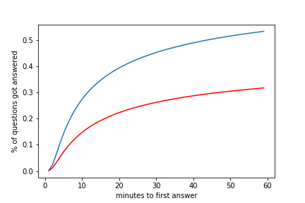
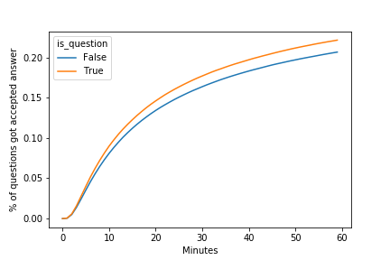

# How Good was a Question Asked?
### A _StackOverflow_ Content Quality Study 

Yuqin Wei  
2019/01/20   

### Background
Stack Overflow features questions and answers on a wide range of topics in computer programming. Questions on Stack Overflow were often among the first search results from Google, and it has been one of the most popular resources for programmers trying to solve a common problem. Large volume of user-generated data builds up the community and leads to its success.  

Since all contents are user-generated, the quality of part of the posts can be questionable. This can be harmful to the whole community in a lot of ways. It creates dummy contents that are both a waste of resource and a distraction to people from more useful information. Some posts may provide wrong and mis-leading information, damage the intergrity and reputation of the community. Some comments are purely people judging and hating each other and being irrelevant to topics. There can also be questions that are potentially valueable, but not properly asked or presented, and as a result not really got a reasonable answer.

In this report, I will try to use some basic data analytics and machine learning tools to dig into the _StackOverflow_ Database, and explore data patterns and potential reasons why some questions can not be answered.

### Data Acquisition and Pre-processing

Stack Overflow shares all historical post data through [stackexchange](https://data.stackexchange.com/). Google provides free access to the data but you have to query through Google BigQuery to pull the data with limited quota.   
Separately, Brent Ozar converts xml format to SQL Server database and posted in his blog post that can be downloaded from [here](https://www.brentozar.com/archive/2015/10/how-to-download-the-stack-overflow-database-via-bittorrent/).

I downloaded a cut of data from 2008 to December 2017, set up a MS SQLServer on Docker and port in the downloaded image. Further, we can easily run some SQL queries on the database. Instead, I converted some partition of the database to csv files after some quick pre-processing steps, so that it's more reproducible in Jupytor notebooks.

Here are the links to the relavent [documentation](https://github.com/yuqinouou/Springboard/blob/master/CapstoneProject/doc/DatabaseSetup.md) and [notebook](https://github.com/yuqinouou/Springboard/blob/master/CapstoneProject/notebook/StackOverflowdata_processing.ipynb).

### Exploratory Analysis and Feature Extraction

#### Time Trend

The website has be up and running since 2008. We can see a increasing trend of weekly questions posted, and by 2014 and onwards there seems to be a slowdown.

We can zoom-in and take a look at hourly post counts with in a week, and find that there are much more posts on weekdays than at weekend. Furthermore, we tested that Mondays and Fridays question posts numbers are significantly lower than other workdays, statistically.

#### Time to First (Accepted) Answer

After checking thourgh all potential quality measures, such as question "score" or "favorite counts", I decided to use "time to the first (accepted) answer" as a proxy if a question posted will be good enough. This is mainly because the database has timestamps for all answers, and it's much more tracable for every single question. While for other quality measure, these will be the trend that if questions posted for longer will more likely to have a higher score. In addition, 
it is more realiable to measure time to the accepted answer.

Here displays cumulative distribution for both measures within the first hour after a question posted. The blue curve for 'first answer' and the red curve for 'first accepted answer'. We can see that about 50% of questions get an answer within an hour, and 30% of the total will get the 'best' answer and later on got accepted.

But what we observed above is largely confounded by when those questions were posted. As we can see on the next two plots, the proportion of 'accepted questions' are declining by years. 

The percentage of questions got a good answer within an hour dropped from above 40% in 2008 to 20% in 2017, and from 60% to 30% within a day. A couple of reasons can contribute to this problem. Growing user base might actually diluted the quality of the content and average user activity. There are centain topics well covered in question posts in the past, then people are running out of good questions on that topic, and result in more duplications and mediocre content.  
While this can separately be an intersting topic, for this study I later on focused only on posts in 2017, to reduce the influence from secular trend.

### Tags

Users are allowed to put tags on the post, so we can keep track of specific area that each question belong to. In this dataset, I think it's okay to assume that tags are pretty good quality data, since users are probably sure about on which topic they are asking the question, even question itself may not necessarily be well stated.

There are over 50,000 tags even been used, but we can see that over 90% of tags have only been tagged for less than 1,000 times. 

I extracted the top popular tags by each year, and we can see the change of popularity.

`C#` was once the most popular, but was replaced by `java`, and then `javascript` in 2013. `java` and `php` are all-time favorites. `python` jumped all the way to the second place in 2017!

On the next chart, I picked the top 30 most popular tags and we can visualize how often they've been used by time.

A lot interesing stories we can read from the chart. 

+ Some tags stay popular across years, such as `javascript`, `java`, `c#`, `php`.  
+ Some tags were losing popularity from year to year, such as `jquery`, `objective-c`, `.net`, `ruby`, `iphone`.  
+ Some tags wer once new to the community, such as `android` and `ios` in 2010. `angularjs` and `swift` in 2014.  
+ Some tags kept strong increasing trend such as `python`, `R`, `json`, `node.js`.  

### Text Data

Due to time constraint and the complexity of the problem, I mainly focused on html tags used in the main body of a question post. This gives us information about how much efforts the editor put into formatting the post, such as inserting charts and code chunks to improve readability.

The folloing features were extracted with regular expression: 

- Number of paragraphs
- Number of code chunks
- Number of pre-formatted text chunk
- Total number of html tags used
- Image file links
- Total number of external links
- Length of title (after cleaning)
- Is the title a statement or a question?
- Any use of 'polite' manner words in text.

There are about 34% of posts using a 'question' title, and 30% of posts contain phrases such as 'thank' and 'appreciate'.  

### Inferential Statistic Modeling

#### Post Frequency by Weekdays

We have seen that Fridays might have fewer posts than other working days of the week. We can run a statistical test to see if that observation is statistically significant. The table below demonstrated the average number of posts in 2017 by each day of the week.

Weekday|Average Number of Questions
-------|------
Monday|7535
Tuesday|8259
Wednesday|8512
Thursday|8418
Friday|7502
Saturday|4124
Sunday|4011

First I drawed a bar chart with confidence interval. We can see that Monday and Friday confidence interval overlaps strongly, while both are way below other workdays.

Two t-test were performed to compare Monday vs. Friday and Monday&Friday vs. other days.  

Comparison|T-statistics|P-value
-------|------|----
Mon vs. Fri|0.27|0.784
Mon&Fri vs. Tue&Wed&Thu|-12.38|<0.001

So we failed to reject the first hypothesis, meaning that there doesn't seem to be a difference between Monday and Friday, and we reject the second test, meaning that posts on Mondays and Fridays are significantly fewer than other working days.

#### Does it help to put a question in the title?

34% of question posts using a 'question' as the title while the remaining 66% are using a 'statement' title. That might help to attract more readers if they find the same question through search engine. But is that difference statistically real?

Question Title or Statement Title?|Answered within 1h|No answer with 1h
---|---|---
Question|175,148(22.2%)|612,391(77.8%)
Statement|319,188(20.8%)|1,218,570(79.2%)

By running a two sample proportion test, we can get a p-value < 0.001, indicating what we observed above is statistically significant.

### Machine Learning Models

#### Feature Clustering

First, I tried to running a clustering model only using features we extracted from text data. The purpose is to see if we can find patterns within those features that could explain different styles of posts.

After pre-processing those features with scaling and PCA, a Kmean model was fitted, with n_clusters = 5, when we observe inertia descreased much slower for more than 5 clusters.

| label | size | paragraph_count | code_count | pre_count | img_count | href_count | title_count | is_question | is_thankful |
|-------|------|-----------------|------------|-----------|-----------|------------|-------------|-------------|-------------|
| 0 | 101,812 | 7.32 | 2.34 | 1.17 | 1.84 | 2.64 | 6.54 | 0.32 | 0.33 |
| 1 | 847,731 | 3.5 | 1.83 | 1.09 | 0.06 | 0.21 | 5.75 | 0.0 | 0.0 |
| 2 | 578,392 | 4.29 | 1.64 | 1.09 | 0.07 | 0.22 | 6.33 | 0.32 | 1.0 |
| 3 | 299,060 | 8.41 | 7.32 | 3.7 | 0.06 | 0.32 | 6.45 | 0.25 | 0.3 |
| 4 | 498,302 | 3.29 | 1.83 | 0.98 | 0.06 | 0.21 | 7.18 | 1.0 | 0.0 |

By checking mean values for each feature, we can get an idea of different styles of question posting:  

   - Level 0. wordy questions with a lot paragraphs and code chunks.  
   - Level 1. questions with narritive title and no thankful words.  
   - Level 2. questions with question title and no thankful words.  
   - Level 3. wordy questions with a lot paragraphs, less code chunks but more images and external links.  
   - Level 4. questions with good manner words.  
    
Looking at time to first accepted answer, Level 0 category has different trend comparing with others. It takes a while to get a quality answer, but after 45 minute mark, it will be the most likely to get answered.  

Other categories has approximately the same shape of the curve, but different proportion of getting an answer, with Level 2 questions at the top, followed by Level 1 and Level 4. Level 3 is the least likely category.  

Comparing 1 to 2, it is more appreciated if the title is a question not a statement. Comparing 1,2 with 4, we got the feeling that it's actually unnecessary to be 'polite'. To me this is counter-intuitive, no one hates good manners.  

But I think this implies we missed some important features that confounded the result. For example, less-experienced programmers might be less confident in their narritive to the question, and being extremely polite, while it can also be associated with question quality issues such as duplications or unclear question description. Finally, when we look at Level 3, if a lot images and hyperlinks are added to a post, it actually does damage and less likely to get an answer. However, if we extend the time window to one day, Level 3 question will get more answers. It could be those questions are usually full of information, and takes longer to get an good answer, but there is nothing wrong with the question itself.

#### Classification Model
(Still working on it)
Logistic Regression with AUC only .68... But i see improvement on a more complicated model, like randomForest, still testing on it

### Conclusions
#### Main Findings
#### Suggestions to StackOverflow Management

### Future work

- NLP on Text Data, Topic Analysis;
- Find better features for prediction model;
