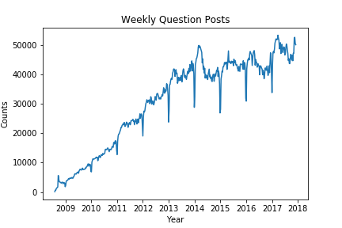
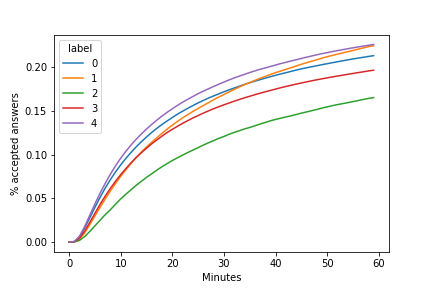

<!-- $theme: gaia -->

# How do I ask a Good Question?

#### A _StackOverflow_ Content Quality Study 

###### Created by [Yuqin Wei (@yuqinouou)](https://github.com/yuqinouou)
###### 2019/01/24 

---
<!-- *template: invert -->
> <big>The art of proposing a question must be held of higher value than solving it.</big>  
> <small> _-- Georg Cantor_</small>

---
<!-- page_number: true -->
<!-- *template: gaia -->
<!-- footer: @yuqinouou -->
# Overview

- ==**Proposed Analtical Work**==
	1. Exploratory Analysis 	
	2. Statistical Inference
	3. Machine Learning Modeling
		+ Feature Clustering
		+ Classification

---

<!-- *template: invert -->
# 1. ==Exploratory Analysis==

---
## Time Trends

 
---

## Daily Trends in a Week

 
---

## Time to First Accepted Answer by Year (1h)

---

## Time to First Accepted Answer by Year (1d)

---

## Time to First Accepted Answer by Year (1d)

---

### Tags 

---

### Tags 

---

### Text Data

- Number of paragraphs
- Number of code chunks
- Number of pre-formatted text chunk
- Total number of HTML tags used
- Image file links
- Total number of external links
- Length of title (after cleaning for stopwords)
- Is the title a statement or a question?
- Any use of appreciation words in the main text

---

<!-- *template: invert -->
# 2. ==Inferential== Statistic Modeling

---

#### Post Frequency by Weekdays

Weekday|Average Number of Questions
-------|------
Monday|7535
Tuesday|8259
Wednesday|8512
Thursday|8418
Friday|7502
Saturday|4124
Sunday|4011

---
#### Post Frequency by Weekdays

Comparison|T-statistics|P-value
-------|------|----
Mon vs. Fri|0.27|0.784
Mon&Fri vs. Tue&Wed&Thu|-12.38|<0.001

---

#### Does it help to put a question in the title?

34% of question posts using a "question" title while the remaining 66% are using a "statement" title. 

Question Title or Statement Title?|Answered within 1h|No answer with 1h
---|---|---
Question|175,148(22.2%)|612,391(77.8%)
Statement|319,188(20.8%)|1,218,570(79.2%)

---

<!-- *template: invert -->
# 2. ==Machine Learning== Modeling

---
## Feature Clustering

#### K-mean with `n_clusters = 5`

---

#### Feature Clustering

| label | size | para- graph count | code count | pre count | tag count | img count | href count | title count | is question | is thankful |
|:-------|:------|:-----------------|:------------|:-----------|:-----------|:-----------|:------------|:-------------|:-------------|:-------------|
| 0 | 839,588 | 3.44 | 1.8 | 1.09 | 6.91 | 0.06 | 0.2 | 5.75 | 0.0 | 0.0 |
| 1 | 330,486 | 8.48 | 7.1 | 3.47 | 21.49 | 0.06 | 0.34 | 6.47 | 0.27 | 0.31 |
| 2 | 99,203 | 7.28 | 2.25 | 1.15 | 12.33 | 1.86 | 2.64 | 6.54 | 0.32 | 0.33 |
| 3 | 565,753 | 4.17 | 1.59 | 1.08 | 7.49 | 0.07 | 0.22 | 6.31 | 0.31 | 1.0 |
| 4 | 490,267 | 3.21 | 1.75 | 0.96 | 6.48 | 0.06 | 0.21 | 7.18 | 1.0 | 0.01 |

- <small><small>Cluster 0. Questions with statement title and no thankful words.
- Cluster 1. Wordy questions with a lot of paragraphs and code chunks.
- Cluster 2. Wordy questions with a lot of paragraphs, less code chunks but more images and external links.
- Cluster 3. Questions with appreciation words.
- Cluster 4. Questions with question title and no thankful words.
</small></small>
---

## Feature Clustering

---

## Classification Model

Logistic regression with `sklearn.linear_model.SGDClassifier` tuning on `alpha`, `l1_ratio`. The performance score used is `weighted average f1 score`. `5-folds` cross-validation were performed on `70%` of data.

| Final Model | Average F1 | Accuracy | ROC_AUC |
|-------------|------------|----------|---------|
| {'alpha': 0.001, 'l1_ratio': 1} | 0.617 | 0.61 | 0.61 |

---
## Classification Model

---
<!-- template: gaia -->
## Conclusions

- Growth slowed down after 2013, and % of accepted question within day 1 dropped to 30%.
- Users have different styles of posting questions. 
	+ Good Style: more code chunks, emphasizing terms and adding image files; with question titles
	+ Bad Style: too many external links; with long statement titles
- The current prediction model is mediocre.

---

#### Suggestions to _StackOverflow_ Management

launching a prediction model of question quality -

- To remind the question owner and to provide instructions.
- To inform moderators.
- To help improve the community guideline. 
	- The current guideline is well aligned with some of our results. See here [https://stackoverflow.com/help/how-to-ask](https://stackoverflow.com/help/how-to-ask)

---
<!--page_number: false-->
## Acknowledgment

#### Deep appreciation to ==Serena Peruzzo==!
---

# ==That's all!==

# Thanks!

